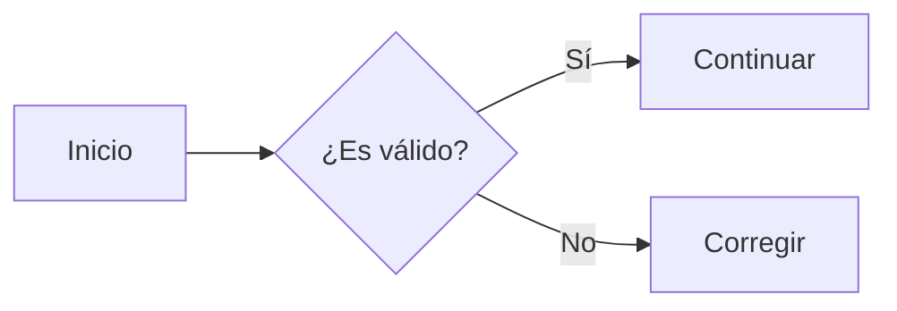

# Lector local de Markdown

Aplicación estática en HTML, CSS y JavaScript para abrir y leer archivos Markdown desde el navegador.

## Ejecución con Live Server

1. Abre esta carpeta en Visual Studio Code.
2. Instala la extensión **Live Server** si aún no la tienes.
3. Haz clic derecho sobre `index.html`.
4. Selecciona **Open with Live Server**.
5. Usa **Abrir archivo** o arrastra un archivo `.md` sobre la página.

El archivo Markdown se lee mediante la API `FileReader`/`File.text()` del navegador. No se sube al servidor ni se guarda fuera del equipo.

## Funciones incluidas

- Selección de archivos `.md` y `.markdown` desde el equipo.
- Cierre del archivo abierto para volver a la pantalla inicial.
- Icono y título de la aplicación enlazados al inicio.
- Arrastrar y soltar.
- Tabla de contenido automática.
- Encabezados, listas, listas de tareas, tablas, citas, enlaces, imágenes y bloques de código.
- Diagramas Mermaid mediante bloques de código `mermaid`.
- Front matter YAML sencillo.
- Tema claro y oscuro.
- Ajuste del tamaño de texto.
- Vista adaptable a escritorio y móvil.
- Impresión limpia.
- Atajos: `Ctrl/Cmd + O`, `Ctrl/Cmd + +` y `Ctrl/Cmd + -`.

## Diagramas Mermaid

Usa un bloque cercado con el lenguaje `mermaid`:

````markdown

````

La aplicación usa Mermaid 11.16.0 desde jsDelivr. Por ello, la primera carga de los diagramas requiere conexión a Internet. Los diagramas se vuelven a generar al cambiar el tema de la aplicación.

## Seguridad

El renderizador escapa HTML incluido en el Markdown y restringe los protocolos permitidos en enlaces e imágenes. Mermaid se inicializa con `securityLevel: "strict"`, que codifica las etiquetas HTML y desactiva la interacción mediante clics dentro de los diagramas.

## Limitaciones

Es un renderizador ligero y no implementa todas las extensiones avanzadas de CommonMark/GFM, como notas al pie o resaltado sintáctico completo. Si Mermaid no puede cargarse o el diagrama contiene un error de sintaxis, la página muestra el código fuente del diagrama como respaldo.
