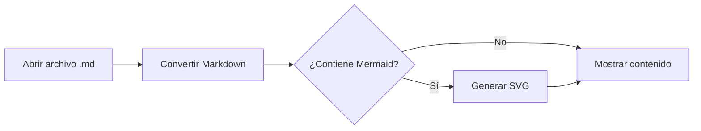

# Documento de ejemplo

Este archivo permite probar el **lector de Markdown** sin necesidad de crear otro documento.

## Características

- Lectura cómoda en pantalla.
- Tabla de contenido automática.
- Modo claro y oscuro.
- Ajuste del tamaño del texto.
- Impresión limpia.

### Lista de tareas

- [x] Crear estructura HTML.
- [x] Agregar estilos de lectura.
- [ ] Abrir un documento propio.

## Tabla

| Elemento | Estado | Comentario |
|:--|:--:|--:|
| Encabezados | Listo | Automático |
| Tablas | Listo | Adaptables |
| Código | Listo | Bloques y línea |

## Código

```javascript
const mensaje = "Hola, Markdown";
console.log(mensaje);
```

> El archivo se procesa localmente en el navegador y no se envía a un servidor.

## Enlace

Puedes incluir [enlaces externos](https://developer.mozilla.org/) e imágenes Markdown.


## Diagrama Mermaid


